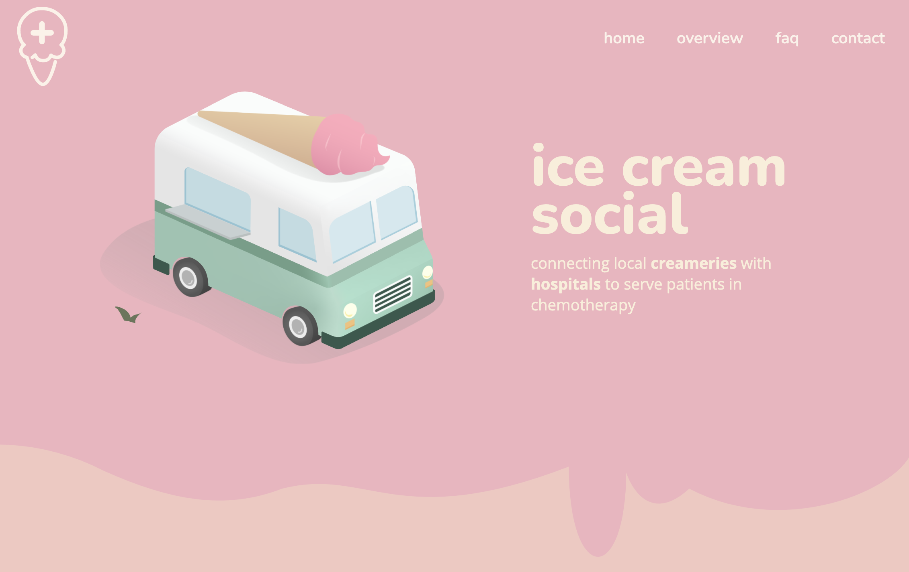

# ice-cream-social
A website redesign for an emerging nonprofit. View it [live](https://icecream.serenapascual.com/).

## About
ice-cream-social is dedicated to connecting creameries with hospitals to provide ice cream to chemo patients during their infusions.

### Process

After a series of sketches, I created a mock-up in Figma and then went to coding.

I illustrated the truck and logo in Adobe Illustrator, animated them in After Effects, and used Lottie to export them for web. I utilized an SVG editor to draw the ice cream drips.

## To-do
- Add loading screen while assets are rendering
  - Alternatively, fully convert truck animation to SVG?
- Illustrate images to replace emojis
- Incorporate modern web design trends with CSS transitions and animations
